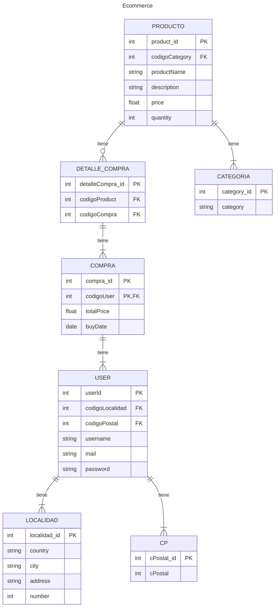

```mermaid
---
title: Ecommerce 
---

erDiagram

DETALLE_COMPRA{
    int detalleCompra_id PK
    int codigoProduct FK
    int codigoCompra FK
}

PRODUCTO ||--|{ CATEGORIA: tiene
CATEGORIA{
    int category_id PK
    string category
}

PRODUCTO ||--o{ DETALLE_COMPRA : tiene
PRODUCTO {
    int product_id PK
    int codigoCategory FK
    string productName
    string description
    float price
    int quantity
}

USER{
    int userId PK
    int codigoLocalidad FK
    int codigoPostal FK
    string username
    string mail
    string password
}

USER ||--|{LOCALIDAD: tiene
LOCALIDAD{
    int localidad_id PK
    string country
    string city
    string address
    int number
}

USER ||--|{CP: tiene
CP{
    int cPostal_id PK
    int cPostal
}

COMPRA ||--|{ USER : tiene
DETALLE_COMPRA ||--|{ COMPRA : tiene
COMPRA {
    int compra_id PK
    int codigoUser PK, FK
    float totalPrice
    date buyDate
}    


```