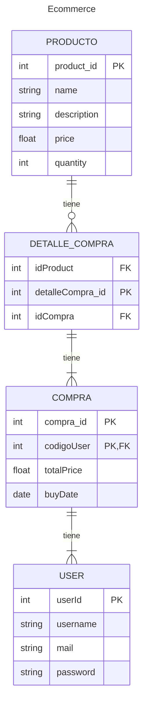

```mermaid
---
title: Ecommerce 
---

erDiagram

DETALLE_COMPRA{
    int idProduct FK
    int detalleCompra_id PK
    int idCompra FK
}

PRODUCTO ||--o{ DETALLE_COMPRA : tiene
PRODUCTO {
    int product_id PK
    string name
    string description
    float price
    int quantity
}

USER{
    int userId PK
    string username
    string mail
    string password
}


COMPRA ||--|{ USER : tiene
DETALLE_COMPRA ||--|{ COMPRA : tiene
COMPRA {
    int compra_id PK
    int codigoUser PK, FK
    float totalPrice
    date buyDate
}    


```